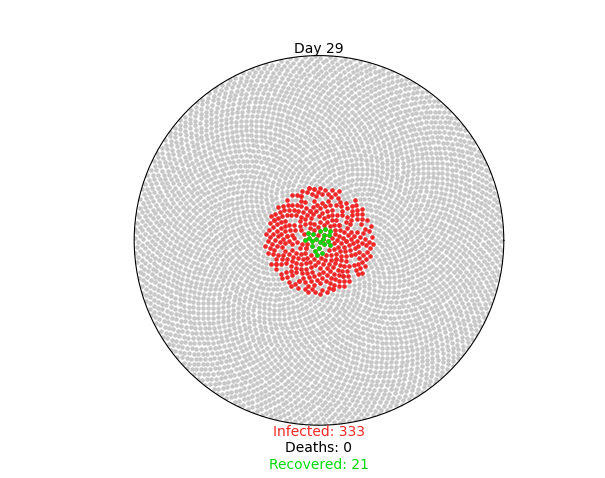

# Simulating-COVID-19-Python 
 
This is a python program I created that simulates the spread of a virus, using covid-19 as an example. This program uses Numpy and Matplotlib for mathematical calculations and data visualization. 

## Pictures
Visualization:

 
